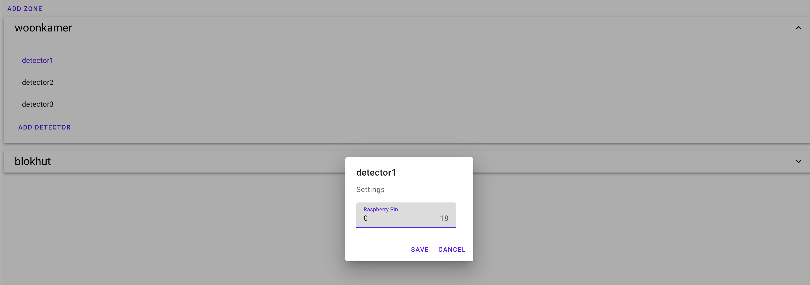
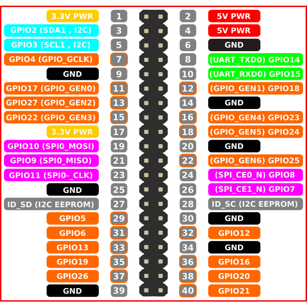
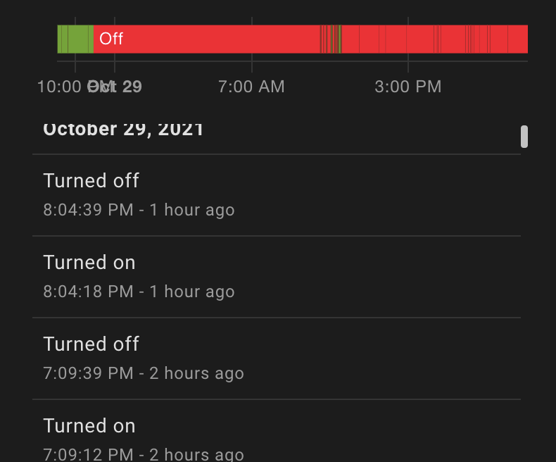
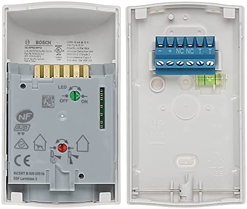

# raspberry-mqqt-motion-alarm

App  you can install for monitoring wired security detectors connected to raspberry pi gpio pins and publish motion detections to mqqt topics with an easy to use web interface


You can add motion zones and add detectors based on the connected raspberry gpio pin

Raspberry pin layout


## MQTT 

You can publish your events to an mqtt ready service.
It can be configured in the config.json ore in env variables.
```
{
  "Mqtt_Host": "192.168.1.165",
  "Mqtt_Port": 181,
  "Mqtt_User": "mqqt_user",
  "Mqtt_Password": "examplepass",
  "Mqtt_Alarm_Message_Active": "payload_on",
  "Mqtt_Alarm_Message_InActive": "payload_off",
  "Mqtt_Alarm_Uptime_Monitoring": "motion"
}
```

The Alarm message active and inactive events are published in "motion/{detector_name}" with value configured in the config file. Uptime monitoring is send by the event "motion" and ads the datetime utc as value


Example sending data to Home assistant




## Tested working with an Bosch ISC-BPR2-WP12 



Other sensors should work the same, buth not tested
When using longer calbes it is recomended to use resitors or shielded cables for interference 


